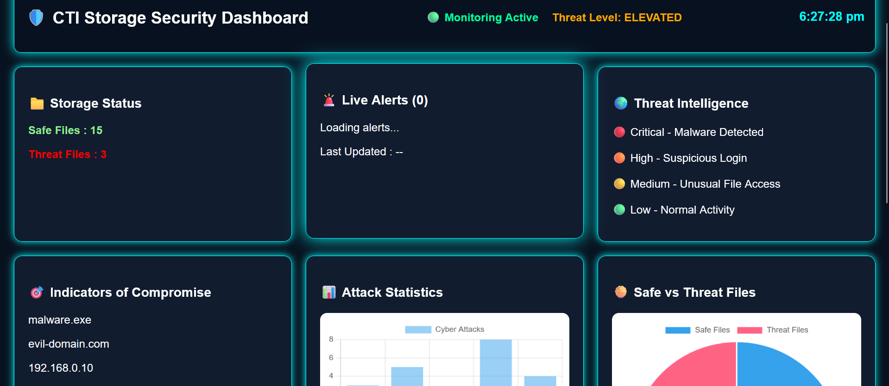

# Cyber Threat Intelligence Dashboard

# Overview
Cyber Threat Intelligence Dashboard is a web-based cybersecurity monitoring system developed using Flask, HTML, CSS, JavaScript, and Chart.js. The dashboard helps monitor threats, view analytics, and generate security reports.

# Features
- User Login Authentication
- Real-time Threat Monitoring
- Security Alerts
- Interactive Dashboard
- Threat Analytics Charts
- Report Download Functionality

# Technologies Used
- HTML
- CSS
- JavaScript
- Python (Flask)
- Chart.js

# Project Structure
backend/
frontend/
screenshots/

# Screenshots

# Login Page

# Dashboard

# Report Download

# Author
Pirthika Annadurai

linkedin: https://www.linkedin.com/posts/pirthika-annadurai-7101662a4_cybersecurity-python-flask-ugcPost-7468652315177271296-zx-V/?utm_source=share&utm_medium=member_desktop&rcm=ACoAAElZnnwBiJx75khj7eg6vZOHoBRoR6BqHmg
